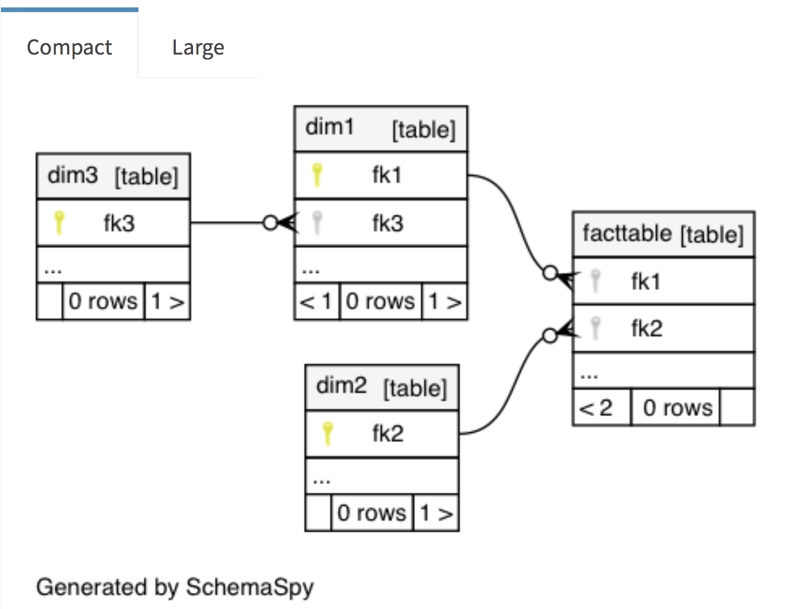
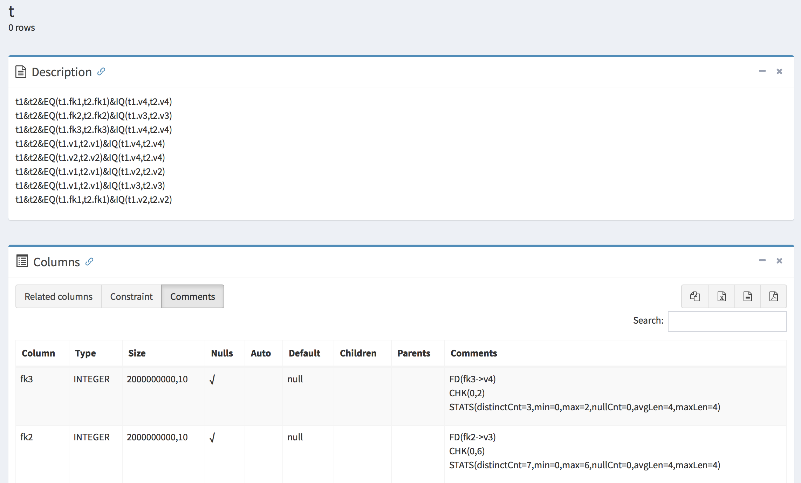

This is an experimental prototype to rummage integrity constraints in Spark catalog tables.
Since Spark does not provide any functionality for
[informational referential integrity constraints](https://issues.apache.org/jira/browse/SPARK-19842) now,
this plugin intends to make users understand defined tables easily in Spark.
To visualize inferred constraints, this plugin generates metadata and
entity-relation diagrams with constraints by [SchemaSpy](http://schemaspy.org/).

***NOTE: This work is in progress, so it only implements simple inferences rules for integrity constraints.***

## How to try this plugin

    # This repository includes a simple wrapper script `bin/python` to create
    # a virtual environment to resolve the required dependencies (e.g., Python 3.6 and PySpark 2.4),
    # then launch a Python VM with this plugin.
    $ ./bin/python

    # Loads CSV data and defines tables in a catalog
    >>> factTable = spark.read.option('header', True).option('inferSchema', True).csv("./testdata/factTable.csv")
    >>> factTable.write.saveAsTable('factTable')
    >>> dim1 = spark.read.option('header', True).option('inferSchema', True).csv("./testdata/dim1.csv")
    >>> dim1.write.saveAsTable('dim1')
    >>> dim2 = spark.read.option('header', True).option('inferSchema', True).csv("./testdata/dim2.csv")
    >>> dim2.write.saveAsTable('dim2')
    >>> dim3 = spark.read.option('header', True).option('inferSchema', True).csv("./testdata/dim3.csv")
    >>> dim3.write.saveAsTable('dim3')

    # Infers integrity constraings and entity-relation diagrams generated by SchemaSpy
    >>> schemaSpyResult = scavenger.setDbName('default').infer()
    >>> schemaSpyResult.show()

## References for Future Work

 - Eduardo H. M. Pena, Eduardo C. de Almeida, and Felix Naumann, Discovery of Approximate (and Exact) Denial Constraints, Proceedings of the VLDB Endowment , 13(3), p266-278, 2019.
 - Tobias Bleifuß, Sebastian Kruse, and Felix Naumann, Efficient Denial Constraint Discovery with Hydra, Proceedings of VLDB Endowment, 11(3), 2017.
 - Kruse, S., et al., Fast Approximate Discovery of Inclusion Dependencies, BTW, p207-226, 2017.
 - Hai Liu, Dongqing Xiao, Pankaj Didwania, and Mohamed Y. Eltabakh, Exploiting Soft and Hard Correlations in Big Data Query Optimization, Proceedings of the VLDB Endowment, 9(12), 2016.
 - Thorsten Papenbrock and Felix Naumann, A Hybrid Approach to Functional Dependency Discovery, Proceedings of SIGMOD'16, p821-833, 2016.
 - Z. Abedjan, L. Golab, and F. Naumann, Profiling Relational Data: A Survey, VLDB Journal, 24(4), p557–581, 2015.
 - X. Chu, I. F. Ilyas, and P. Papotti, Discovering Denial Constraints, PVLDB, 6(13), p1498–1509, 2013.
 - I. F. Ilyas, V. Markl, P. Haas, P. Brown, and A. Aboulnaga, CORDS: Automatic Discovery of Correlations and Soft Functional Dependencies, Proceedings of SIGMOD'04, p647–658, 2004.

