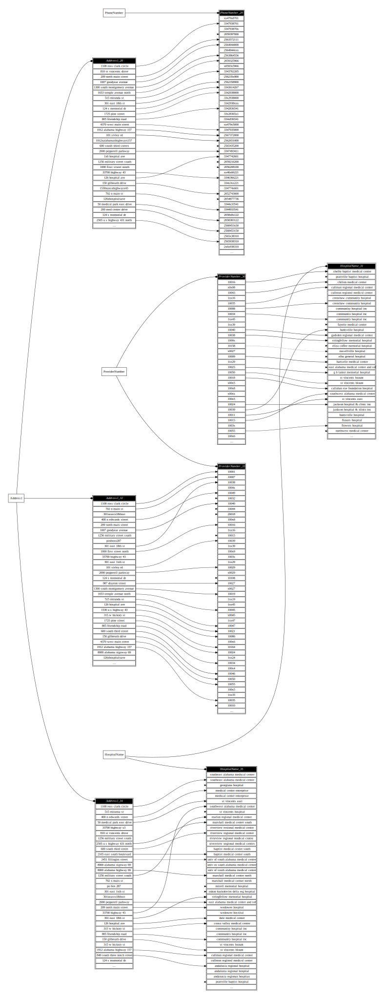

## Visualize Data Dependencies Between Attributes

To analyze data correlation between attributes, you can use a `generateDepGraph` method in the `depphi.misc` API:

```
# Loads and defines a 'hospital' table
>>> spark.read \
...   .option("header", True) \
...   .csv("./testdata/hospital.csv") \
...   .write \
...   .saveAsTable("hospital")

# Generates a Graphviz dot file to represent data dependencies
>>> delphi.misc \
...   .options({
...     "table_name": "hospital",
...     "path": "/tmp/hospital",
...     "filename_prefix": "depgraph",
...     "overwrite": "1",
...     "max_domain_size": "100",
...     "max_attr_value_num": "30",
...     "max_attr_value_length": "70",
...     "min_corr_thres": "0.97"}) \
...   .generateDepGraph()

$ ls /tmp/hospital
depgraph.dot    depgraph.svg
```


